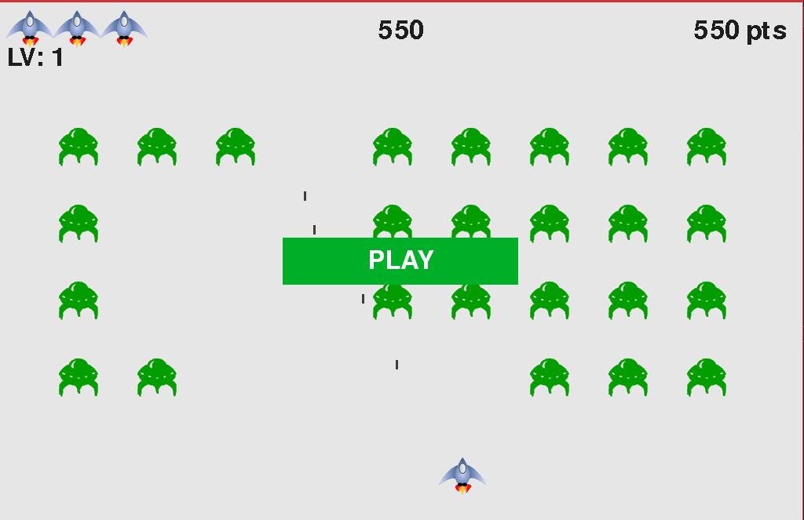

# ALIEN INVASION

  An arcade ship shooting game. Made with pygame

"Alien Invasion" is a classic arcade-style space shooter game where players control a spaceship to defend Earth against waves of invading alien spacecraft. The game typically involves maneuvering the player's spaceship horizontally across the bottom of the screen while shooting at descending waves of alien invaders. The objective is to survive as long as possible, earn points by destroying aliens, and achieve high scores.

Key features often include:

Alien Waves: The game presents players with waves of alien attackers that move in specific patterns or formations, gradually increasing in difficulty.
Player Spaceship: Players control a spaceship at the bottom of the screen, able to move horizontally to avoid enemy fire and collisions.
Shooting Mechanism: The player's spaceship is equipped with a weapon to shoot projectiles at the incoming alien invaders. The goal is to eliminate as many aliens as possible.
Scoring: Players earn points for each alien they destroy. The objective is often to achieve the highest score possible.
Increasing Difficulty: As the game progresses, the speed and complexity of alien waves typically increase, making the gameplay more challenging.
"Alien Invasion" games have been popular since the early days of arcade gaming and have inspired numerous variations and adaptations on different platforms. They continue to be a recognizable and enjoyable genre for players who appreciate fast-paced action and strategic shooting gameplay.

Team Members:Kulpeissov Sultan,Serikova Tabigat,Sultankhan Alken. Topic: Alien invasion

Goal:

To create a Python game in which the player must defend Earth from an alien invasion.

Objectives:

To create a graphical user interface (GUI) for the game. To generate aliens that fly towards Earth. To allow the player to shoot the aliens to destroy them. To track the number of aliens and end the game if their number becomes too large. Plan:

First, the basic structure of the game will be created, including the GUI and functions for generating aliens. Next, functions for shooting aliens and tracking their number will be added. Finally, additional features will be added, such as different types of aliens and difficulty levels. Architecture: The game will use a Model-View-Controller (MVC) architecture to ensure separation of concerns and maintainability. The model will represent the game data, such as the aliens and their number. The view will represent the graphical representation of the game, such as the aliens and the projectiles. The controller will connect the model and the view and will handle the input from the player. Relevance: The game will be relevant to players who are interested in aliens and space battles. Methodology: The game will be developed using an iterative approach, with regular development and testing cycles. Mockups: The following mockups will be created for the game:

Main menu: Will show options for starting the game, selecting a difficulty level, and exiting the game. Game: Will show a screen with aliens flying towards Earth. The player will be able to shoot the aliens to destroy them. Game over: Will show a message if the player has lost the game. Development stages:

The game will be developed in the following stages:

Stage 1: Creating the basic structure of the game. 

Stage 2: Adding functions for shooting aliens and tracking their number. 

Stage 3: Adding additional features, such as different types of aliens and difficulty levels. Expected results: The expected results of the game are to be fun and challenging for players. The game will also be educational, as it will teach players about aliens and space battles.
